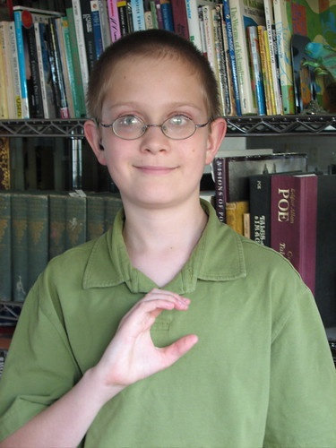
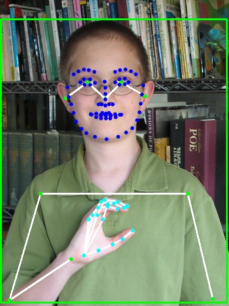

# Simple RTMW

Multi-person whole-body pose estimation using ONNX models with RTMPose and YOLOX detectors.

## Installation

Install from PyPI:

```bash
pip install simple-rtmw
```

Or install from source:

```bash
git clone https://github.com/anath2/simple-rtmw
cd simple-rtmw
pip install .
```

## Quick Start

```python
import cv2
import numpy as np
from simple_rtmw import Wholebody
from simple_rtmw.draw import draw_annotated_image

# Initialize the model
model = Wholebody(device="cpu")  # Use "cuda" or "mps" for GPU

# Load image and run pose estimation
image = cv2.imread("your_image.jpg")
keypoints, scores = model(image)
detection_boxes = model.det_model(image)

# Format results and create visualization
keypoints_with_scores = np.concatenate([keypoints, scores[..., np.newaxis]], axis=-1)
pose_results = model.format_result(keypoints_with_scores)

annotated_image = draw_annotated_image(
    image,
    detection_boxes=detection_boxes,
    pose_results=pose_results
)

# Save the result
cv2.imwrite("output.jpg", annotated_image)
```

## Example Results

<table>
<tr>
<td align="center"><b>Input Image</b></td>
<td align="center"></td>
<td align="center"><b>Output Image</b></td>
</tr>
<tr>
<td></td>
<td align="center" style="font-size: 2em; padding: 0 20px;">➡️</td>
<td></td>
</tr>
</table>

## Features

- **Easy to use**: No depencencies except OpenCV, ONNX and Numpy
- **Multi-platform**: CPU, CUDA, MPS (Apple Silicon) support
- **Flexible visualization**: Customizable drawing with detection boxes and pose annotations

## License

Licensed under the Apache License, Version 2.0. See [LICENSE](LICENSE) for details.

## Acknowledgments

- [RTMPose](https://github.com/open-mmlab/mmpose) for pose estimation models
- [YOLOX](https://github.com/Megvii-BaseDetection/YOLOX) for detection models
- [OpenMMLab](https://openmmlab.com/) for pre-trained models and research
